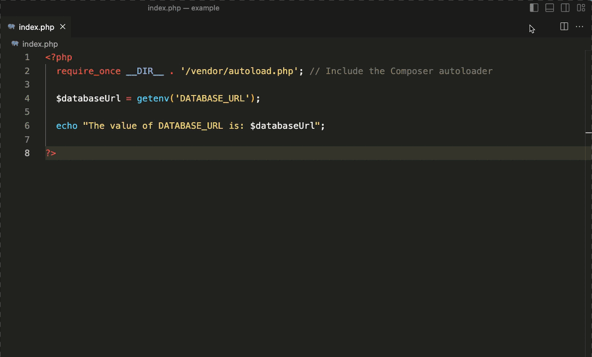

# envkey-php

Integrate [EnvKey](https://www.envkey.com) with your PHP projects to keep API keys, credentials, and other configuration securely and automatically in sync for developers and servers.



This repo is mirrored in two locations:

- [A subdirectory of EnvKey's v2 monorepo](https://github.com/envkey/envkey/tree/main/public/sdks/languages-and-frameworks/php).
- [envkey-php package repo](https://github.com/envkey/envkey-php)

## Installation

```bash
$ composer require envkey/envkey-php
```

## Usage

If you haven't already, download and install EnvKey from our [website](https://envkey.com), then create a new org. Next, follow the ~1 minute [integration quickstart](https://docs-v2.envkey.com/docs/integration-quickstart) to init an app with a `.envkey` file (for connecting development) or generate a server `ENVKEY` (for connecting a server).

At the entry point of your application, be sure you're including the composer autoloader.

```php
require_once 'vendor/autoload.php'; // Include the Composer autoloader
```

Now all your EnvKey variables will be available with `getenv('VARIABLE_NAME')`.

```php
$stripe = new \Stripe\StripeClient(getenv('STRIPE_SECRET_KEY'));
```

### Errors

The package will throw an error if an `ENVKEY` is missing or invalid.

### Overriding Vars

This package will not overwrite existing environment variables or additional variables set in the `.env` file you loaded your `ENVKEY` from. This can be convenient for customizing environments that otherwise share the same configuration. You can also use [branches or local overrides](https://docs-v2.envkey.com/docs/branches-and-local-overrides) for this purpose.

### PHP Request Model / Latency

Unlike other EnvKey language libraries that expect a long-running server process, this library is designed for PHP's short-lived per-request processes. Instead of loading config from an EnvKey host on every request, which would add 100-500ms of latency (depending on location and connection speed), this library caches your encrypted config in RAM in a background process and keeps it up to date. After the first load of EnvKey on a server, subsequent requests will load config from this cache, with effectively zero latency (less than 1 millisecond).

### Working Offline

As mentioned in the previous section, this package caches your encrypted config in RAM. Your config will still be available (though possibly not up-to-date) if you lose your internet connection. When the connection is reestablished, the latest config will be loaded immediately.

## envkey-source

Using a language-specific library like this one is the easiest and fastest method of integrating with EnvKey. That said, the [envkey-source](https://docs-v2.envkey.com/docs/envkey-source) executable, which this library wraps, provides additional options and functionality when used directly from the command line. If you need additional flexibility and it works for your use case, consider using envkey-source directly.

## x509 error / ca-certificates

On a stripped down OS like Alpine Linux, you may get an `x509: certificate signed by unknown authority` error when attempting to load your config. You can fix it by ensuring that the `ca-certificates` dependency is installed. On Alpine you'll want to run:

```
apk add --no-cache ca-certificates
```

## Further Reading

For more on EnvKey in general:

Read the [docs](https://docs-v2.envkey.com).

Read the [integration quickstart](https://docs-v2.envkey.com/docs/integration-quickstart.html).

Read the [security and cryptography overview](https://docs-v2.envkey.com/docs/security).

## Need help? Have questions, feedback, or ideas?

Post an [issue](https://github.com/envkey/envkey/issues), start a [discussion](https://github.com/envkey/envkey/dicussions), or email us: [support@envkey.com](mailto:support@envkey.com).
