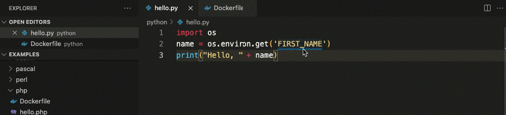

# envkey-vscode

## ⚡️ Autocomplete and type checking for **environment variables** in 46 languages.

Instead of a typeless, error-prone mystery blob, make the environment a **first-class citizen of your IDE.**

## 🛡️ Simple, secure configuration and secrets management

envkey-vscode is a VS Code extension for [EnvKey](https://www.envkey.com), an **open source**, **end-to-end encrypted** configuration and secrets manager. It keeps API keys, credentials, and other configuration securely and automatically in sync for developers and servers.

## 🚀 Get Started

- Download and install EnvKey from our [website](https://envkey.com), then create a new org.

- Follow the ~1 minute [integration quickstart](https://docs-v2.envkey.com/docs/integration-quickstart) to integrate your first app's development environment.

- Install the envkey-vscode extension from the VSCode marketplace.

## 🌟 Features

- 📝 **Autocomplete**: when you access environment variables in any one of 46 supported languages, all your EnvKey variables will be available to filter and select.

- 🔍 **Peek-on-hover**: a quick hover tells you the development value of a variable. No need to go check another file.

- ✅ **Type checking**: if you reference an environment variable that hasn't been set, VSCode will warn you with an orange squiggly, helping you catch typos and prevent bugs.

- 🔄 **Real-time updates**: when you or anyone on your team updates a development environment variable in EnvKey, that change will be reflected immediately in VSCode.

- 🌐 **Support for 46 languages**: simplify and unify configuration management across languages, teams, and systems.

- 🔒 **Secure and private**: real, no-nonsense, client-side end-to-end encryption with OS keychain integration. Avoid trusting secrets to servers, third parties, and web browsers.

## 💻 Supported Languages

- Python, JavaScript, TypeScript, Ruby, PHP, Perl

- Java, Go, Rust, C, C++, C#, Lua, Zig, D

- Shell, Dockerfile, Docker Compose, Makefile, Powershell, AppleScript

- R, Julia, SAS

- Scala, Clojure, Kotlin, Groovy, Swift, Dart, VB.NET

- Elixir, Erlang, Haskell, Ocaml, F#, Prolog, Racket, Common Lisp, Scheme

- Nim, Crystal, Ada, Delphi, Pascal, Fortran, VBA

## 📘 Further Reading

For more on EnvKey in general:

Read the [docs](https://docs-v2.envkey.com).

Read the [security and cryptography overview](https://docs-v2.envkey.com/docs/security).

## ❓ Need help? Have questions, feedback, or ideas?

Post an [issue](https://github.com/envkey/envkey/issues), start a [discussion](https://github.com/envkey/envkey/discussions), or email us: [support@envkey.com](mailto:support@envkey.com).
